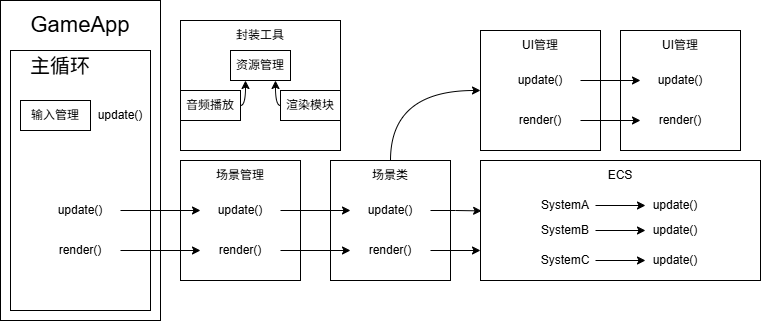
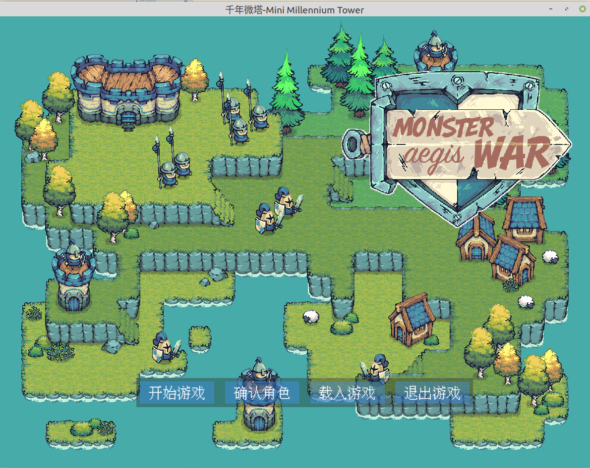
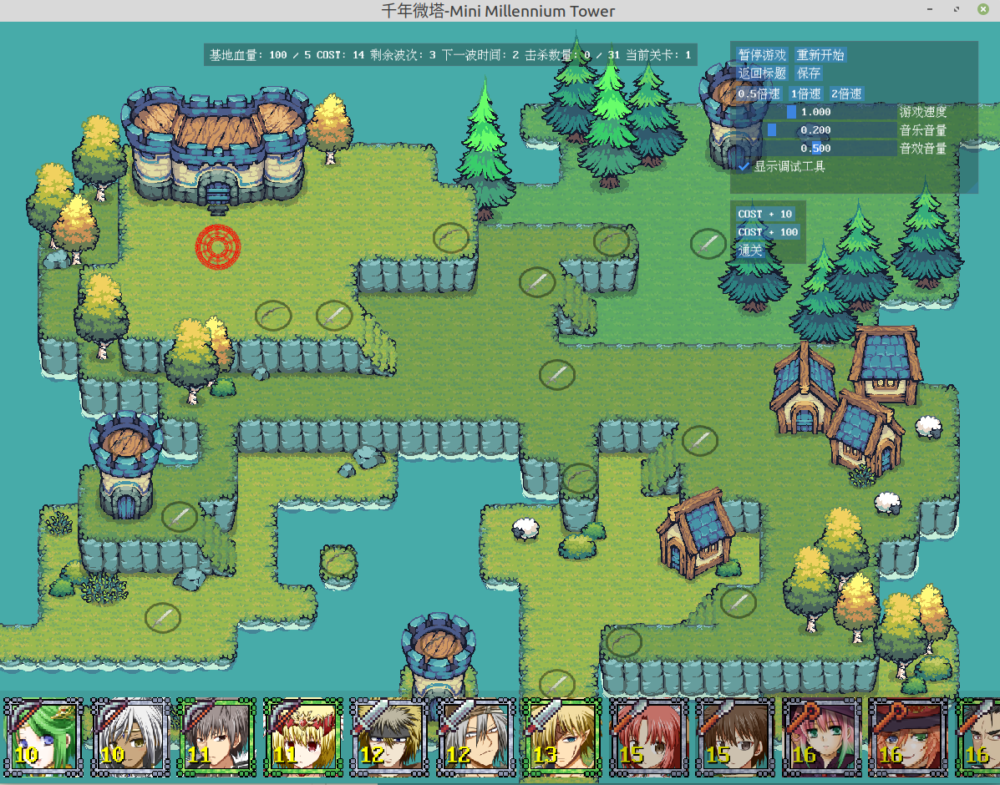
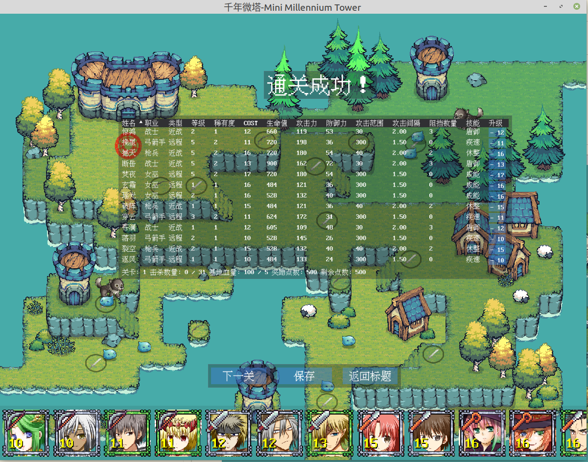
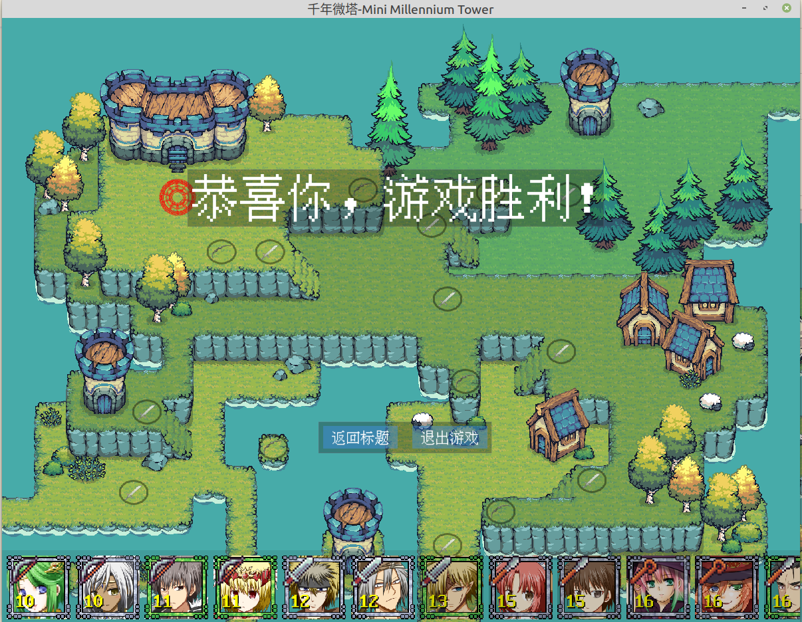
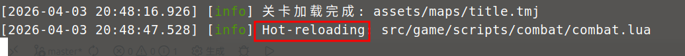

# 千年微塔 - Mini Millennium Tower

> 基于 C++ & Lua 开发的轻量级塔防游戏
> 采用 ECS 架构 + 上下文管理，实现高灵活、高扩展的游戏框架

---

## 🎮 项目介绍
这是一个 C++ & Lua 混合架构的轻量级塔防游戏项目。
项目全面采用 **ECS 实体组件系统** 与 **context 上下文管理**，实现模块化、低耦合、高可扩展的游戏架构。

---

## ✨ 项目特性
- 纯 ECS 架构设计，逻辑解耦、易于扩展
- C++ 高性能核心 + Lua 灵活逻辑脚本
- 完整塔防核心流程：建造、战斗、技能、路径、AI
- 基于 SDL3 跨平台渲染、音频、字体、图片系统
- 内置 ImGui 调试界面，方便开发与调参
- 日志、动画、特效、战斗、Buff 系统全覆盖

---

## 🧱 项目架构

---

## 🚀 核心模块
1. **实体生命管理系统**
   负责游戏内所有可交互实体（角色、怪物、NPC 等）的创建、属性、状态、销毁等生命周期管理。

2. **移动与路径系统**
   实现寻路算法、移动逻辑、碰撞检测，支持自动寻路与手动操控。

3. **战斗系统**
   处理战斗流程、伤害计算、胜负判定、战斗结算。

4. **技能与 Buff 系统**
   管理技能释放、Buff / Debuff 生命周期、效果同步。

5. **动画与特效系统**
   负责视觉表现、技能特效、场景动画播放。

6. **游戏规则系统**
   关卡逻辑、胜负条件、资源管理、游戏核心规则。

7. **单位放置与选择系统**
   塔防建造、单位选中、编队、交互操作。

8. **渲染与 UI 系统**
   画面渲染、UI 绘制、玩家交互入口。

---

## 🛠️ 技术栈与外部库
- [Lua](https://www.lua.org/)
- [entt](https://entt.dev/)
- [SDL3](https://www.libsdl.org/)
- [SDL3_image](https://github.com/libsdl-org/SDL_image)
- [SDL3_ttf](https://github.com/libsdl-org/SDL_ttf)
- [SDL3_mixer](https://github.com/libsdl-org/SDL_mixer)
- [sol2](https://github.com/ThePhD/sol2)
- [glm](https://glm.g-truc.net/)
- [nlohmann/json](https://github.com/nlohmann/json)
- [spdlog](https://github.com/gabime/spdlog)
- [imgui](https://github.com/ocornut/imgui)

---

## 🧩 职责说明
- **C++**：游戏核心逻辑、物理引擎、渲染系统、底层模块
- **Lua**：游戏逻辑脚本、事件处理、配置表、热更逻辑

---

## 📦 构建说明
具体编译与运行方法请参考：
[BUILD.md](BUILD.md)

---

## 📄 许可证
[MIT License](LICENSE)

## 预览

